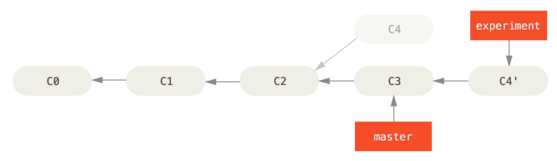

# Git

>使用 Git 的时候，建议每一次都按照**功能**或者**业务**提交，确保每一次提交都是一个完整的功能或者业务，按照这种使用方法，后面使用 Git 的时候，就会越来越顺心。

对于 Git[^git-doc] 仓库的管理使用，一般分为三个步骤：初始化、配置、管理。

## 1 仓库初始化

仓库初始化，一般有两种方式：远程拉取与本地创建。

### 1.1 本地创建

创建本地仓库

```shell
git init
```

* init 命令有许多参数，这里只是一些基本介绍，想深入了解的话，请参考`git init --help` 或者 [git init](https://git-scm.com/docs/git-init)。

### 1.2 远程拉取

#### 1.2.1 clone 仓库

```shell
git clone <git-url>
```

#### 1.2.2 clone 仓库分支

```shell
git clone -b <branchname> --single-branch <git-url>
```

#### 1.2.3 clone 仓库以及 Submodule

```shell
git clone --recurse-submodules <git-url>
```

* `<git-url>`： 是仓库地址
* `<branchname>` ：仓库分支名字
* 要想深入了解，参见`git clone --help` 或者 [git clone](https://git-scm.com/docs/git-clone)

## 2 配置仓库

不管是本地创建的还是远程拉取的，都需要配置仓库信息，比如账号邮箱信息。

### 2.1 配置用户名

```shell
git config [--global] user.name <name>
```

### 2.2 配置用户邮箱

```shell
git config [--global] user.email <email>
```

* `--global`为可选参数，这里可以有 `--system`, `--global`, `--local`, `--worktree` and `--file <filename>` 几种值，一般常用的是 `--global`，表示当前电脑用户的 git 全局配置用户。
* 要想深入了解，参见`git config --help` 或者 [git config](https://git-scm.com/docs/git-config)

### 2.3  配置 Terminal 颜色主题

```shell
git config --global color.ui auto
```

### 2.4 查看配置信息

查看 git 仓库用户名

```sh
git config [--global] user.name
```

查看 git 仓库用户邮箱

```sh
git config [--global] user.email
```

### 2.5 更换仓库地址

当 git 服务器地址变更的时候，需要更换本地仓库跟踪的远程服务器仓库地址，这种使用情况一般比较少，但也不是没有。

* 更换仓库地址

```sh
git remote set-url origin <git-url>
```

* 也可以先删除旧的，再添加新的

```sh
git remote rm origin
git remote add origin <git-url>
```

* 查看远程地址

```sh
git rmeote -v
```

## 3 仓库管理

### 3.1 分支

### 3.1.1 创建分支

* 创建新分支

```sh
git branch <new-branch>
```

* 切换分支

```sh
git checkout <branch>
```

* 创建分支，并切换到新分支

```sh
git chekcout -b <new-branch>
```

* 本地创建新分支后，远程服务器上还没有分支，这种情况下做 `pull`操作的话，因为远程没有相应分支，会出现下面这种情况：

```sh
➜  git pull 
There is no tracking information for the current branch.
Please specify which branch you want to merge with.
See git-pull(1) for details.

    git pull <remote> <branch>

If you wish to set tracking information for this branch you can do so with:

    git branch --set-upstream-to=origin/<branch> <new-branch-name>
```

如果，你按照提示执行命令

```sh
➜  git branch --set-upstream-to=origin/<branch> <new-branch-name>
error: the requested upstream branch 'origin/test' does not exist
hint: 
hint: If you are planning on basing your work on an upstream
hint: branch that already exists at the remote, you may need to
hint: run "git fetch" to retrieve it.
hint: 
hint: If you are planning to push out a new local branch that
hint: will track its remote counterpart, you may want to use
hint: "git push -u" to set the upstream config as you push.
```

继续按照提示执行命令

```sh
➜  git push --set-upstream origin <new-branch-name>

·······
# test 是我所在的分支名称，<new-branch-name>为你所在的分支名称
To 192.168.13.159:hepeng.l/git_hp.git
 * [new branch]      test -> test
Branch 'test' set up to track remote branch 'test' from 'origin'.
```

到这一步，说明本地分支与远程分支就关联起来了，本地分支同时也有了远程分支的跟踪信息。其实出现 `There is no tracking information for the current branch.` 这种情况，基本上可以认定为本地分支是一个新的分支，然后你做了 `git pull` 操作，这个时候的解决方式，直接`git push --set-upstream origin <new-branch-name>`就好了。

一般，这种操作是不会出现的，但是我刚接触 git 的时候，脑子一片浆糊，就乱操作，时而就会遇到这种情况，这里记录下来，提醒一下。

### 3.1.2 删除分支

* 删除本地分支

```sh
git branch -d <branch>
```

* 删除远程分支

```sh
git push origin --delete <branch>
```

### 3.1.3 修改分支

修改分支，是一个有一定风险的操作，所以操作的时候，要谨慎，操作稍有不慎，就会影响后续操作或者影响其他同事。

比如仓库当前状态是这样的


* 合并分支(merge)

在合并分支前，确保两个分支里，都是干净的，即两个分支里的 workcopy 里没有要 `add` 的，stage 里没有要 `commit` 的。

比如现在有两个分支 master 与 experiment，当前分支 master 分支，要合并 experiment 分支

```sh
git merge experiment
```


* [变基(rebase)](https://git-scm.com/book/zh/v2/Git-分支-变基)

变基操作不大好理解，一般也用的比较少，其实这个操作的作用就是让提交历史比较干净，提交历史像一条直线一样，没有分叉。`merge` 操作会有明显的分支合并痕迹。

因为 `rebase` 不好理解，这里就多啰嗦两句，`rebase` 的原理是首先找到这两个分支（即当前分支 experiment、变基操作的目标基底分支 master） 的最近共同祖先 C2，然后对比当前分支相对于该祖先的历次提交，提取相应的修改并存为临时文件， 然后将当前分支指向目标基底 C3, 最后以此将之前另存为临时文件的修改依序应用。

```sh
git checkout experiment
git rebase master
```



变基操作后，回到 master 分支，进行一次快进合并操作

```sh
git checkout master
git merge experiment
```

最终结果如下


`merge` 与 `rebase` 这两个操作的结果是一样的，都合并了修改的内容。

### 3.1.4 查询分支

* 查询本地分支

```sh
git branch
```

* 查询远程分支

```sh
git branch --remote
```

* 查询本地及远程分支

```sh
git branch -a
```

#### 3.1.5 同步分支

推送本地分支到远程，有两种情况

* 远程已有相应分支，这种情况，比较简单

```sh
git push
```

* 远程没有相应分支，这种情况，要先设置本地分支的远程关联分支，然后再`push`

```sh
git push --set-upstream origin <branch>
git push
```

直接 `push` 的话，git 会提示

```sh
fatal: The current branch <branch> has no upstream branch.
To push the current branch and <branch> the remote as upstream, use

    git push --set-upstream origin <branch>
```

* [git 分支](https://git-scm.com/book/zh/v2/Git-分支-分支简介)

### 3.2 版本管理

### 3.2.1 文件跟踪

工作目录下的每一个文件都不外乎这两种状态：已跟踪 或 未跟踪。

已跟踪的文件是指那些被纳入了版本控制的文件，在上一次快照中有它们的记录，在工作一段时间后， 它们的状态可能是未修改，已修改或已放入暂存区。

工作目录中除已跟踪文件外的其它所有文件都属于未跟踪文件，它们既不存在于上次快照的记录中，也没有被放入暂存区。


#### 3.2.2 Workcopy

当前编辑器展示的文件以及文件夹，是 git workcopy 里的。

#### 3.2.3 Stage/Index

可以用 `git add <file>` 或者 `git add .` 添加到 git stage 里，git 记录为`to be committed`，显示的状态为 `modified` 或 `new file`。

#### 3.2.3.1 缓存

git 缓存一般用的也不多，一般在处理忽略文件的时候使用到。实际上，缓存里操作的是 Stage 里面的内容。

##### 3.2.3.1.1 缓存清理

假设，有一个 .config 文件，之前已经加入了 git 文件跟踪，现在突然发现把它加入 git 管理是不合适的，想把它移除 git 管理，但是还在项目里（workcopy），这时，可以这么操作

```sh
git rm --cached  .config
git add .
```

如果是文件夹的话

```sh
git rm -r --cached  .config/
git add .
```

如果说，这个文件再也不要了，那么，可以这么操作

```sh
git rm -f .config
```

文件夹的话，就这样

```sh
git rm -rf .config/
```

* 因为清理缓存的操作，有一定的危险性，在使用之前，可以先使用 `-n` 参数查看一下运行操作的结果，确认无误后再执行。

#### 3.2.4 Commit

使用 `git commit` 命令操作后，文件被加入到本地仓库里面了，即本地仓库的当前分支头 `HEAD` 的指向。

正常 commit 操作，没什么可说的，有一种情况不常见，但也有时会用到：`git-chery-pick`[^git-chery-pick]，这个操作选择某一个 commit 插入到当前分支。比如在 `test` 分支，发现了一个 bug，一不小心在 `develop` 分支上修改了，这个时候你又回到了 `test` 分支，为了修复这个bug，你不想来回的在这两个分支切换，此时，可以用这个`git-chery-pick`命令从 `develop` 上选择你想要的那个 commit 插入到 `test` 分支上来。

#### 3.2.5 回滚

git reset[^git-reset]回滚操作，其实分为两个部分

* 从 Stage 撤销

假设这种情况，一个文件或者几个文件，你刚做了修改，但是发现改的不对，并且没有对该文件使用`git add`操作，想撤销修改，那么，可以这么操作

```sh
git restore <file> 
# 或者
git checkout <file> 
```

如果已经使用了`git add`操作，则

```sh
git restore  --staged <file> 
```

或者

```sh
git reset test.md
git checkout <file> 
```

* 从 本地仓库 回滚

如果，使用了`git commit`命令，要回滚的话，则需要

```sh
git reset --hard [HEAD]
```

* 不给 HEAD 参数，默认为 HEAD。这个命令后面携带 `commit id`，`commit id` 可以用 `git log` 查看。
* HEAD 表示仓库当前状态，想回到 HEAD 上一个历史，可以用 HEAD^ 表示，上上一个历史 HEAD^^ 表示，以此类推。
* 这里携带了`--hard`参数，还有几个其他的参数，常见的有 `--mixed` 与 `--soft`，`git reset` 不携带这三个的任何一个的时候，默认 `--mixed`。

说到这里就多说一句，这三个参数到底有啥作用

* `--soft`：重置HEAD到另外一个commit。
* `--mixed`：重置HEAD到另外一个commit,并且重置 stage/index 以便和HEAD相匹配。
* `--hard`： 重置HEAD到另外一个commit，重置 stage/index 以便反映HEAD的变化，并且重置workcopy，使仓库HEAD，stage，workcopy 三者保持一致。

参考资料：

* [git 撤销操作](https://git-scm.com/book/zh/v2/Git-基础-撤消操作)
* [拜托，不要再问我Git如何回滚代码](https://zhuanlan.zhihu.com/p/137856034)

### 3.4 Stash

有时，当你在项目的一部分上已经工作一段时间后，所有东西都进入了混乱的状态， 而这时你想要切换到另一个分支做一点别的事情。 问题是，你不想仅仅因为过会儿回到这一点而为做了一半的工作创建一次提交。 针对这个问题的答案是 git stash 命令。

贮藏（stash）会处理工作目录的脏的状态——即跟踪文件的修改与暂存的改动——然后将未完成的修改保存到一个栈上， 而你可以在任何时候重新应用这些改动（甚至在不同的分支上）。

#### 3.4.1 创建 stash

```sh
git stash 
# 或者
git stash push
```

#### 3.4.2 删除 stash

使用 `git stash drop` 加上将要移除的贮藏的名字来移除它

```sh
#删除某一个 stash
git stash drop stash@{0}
#删除所有 stash
git stash clear
```

#### 3.4.3 应用 stash

```sh
git stash apply [--index] [<stash>]
# 或者应用指定的 stash
git stash apply stash@{2}
```

还有一个应用 stash 的 `pop` 命令

```sh
git stash pop [--index] [<stash>]
```

stash 应用了 `pop` 之后，会被删除，而 `apply` 不会被删除。

#### 3.4.4 查询 stash

```sh
git stash list
stash@{0}: WIP on master: 049d078 added the index file
stash@{1}: WIP on master: c264051 Revert "added file_size"
stash@{2}: WIP on master: 21d80a5 added number to log
```

* [git stash](https://git-scm.com/book/zh/v2/Git-工具-贮藏与清理)

### 3.5 Git Hook

Hook 分为两种：客户端 Hook 与服务端 Hook，客户端钩子由诸如提交和合并这样的操作所调用，而服务器端钩子作用于诸如接收被推送的提交这样的联网操作。

#### 3.5.1 安装一个钩子

钩子都被存储在 Git 目录下的 hooks 子目录中。 也即绝大部分项目中的 .git/hooks 。 当你用 git init 初始化一个新版本库时，Git 默认会在这个目录中放置一些示例脚本。 这些脚本除了本身可以被调用外，它们还透露了被触发时所传入的参数。 所有的示例都是 shell 脚本，其中一些还混杂了 Perl 代码，不过，任何正确命名的可执行脚本都可以正常使用 —— 你可以用 Ruby 或 Python，或任何你熟悉的语言编写它们。 这些示例的名字都是以 .sample 结尾，如果你想启用它们，得先移除这个后缀。

把一个正确命名（不带扩展名）且可执行的文件放入 .git 目录下的 hooks 子目录中，即可激活该钩子脚本。 这样一来，它就能被 Git 调用。接下来，我们会讲解常用的钩子脚本类型。

#### 3.5.2 客户端钩子

客户端钩子分为很多种。 下面把它们分为：提交工作流钩子、电子邮件工作流钩子和其它钩子。

##### 3.5.2.1 提交工作流钩子

```txt
pre-commit: 在键入提交信息前运行。
prepare-commit-msg: 在启动提交信息编辑器之前，默认信息被创建之后运行。
commit-msg: 可以用来在提交通过前验证项目状态或提交信息。
post-commit: 在整个提交过程完成后运行。
```

##### 3.5.2.2 电子邮件工作流钩子

```txt
applypatch-msg: 可以用该脚本来确保提交信息符合格式，或直接用脚本修正格式错误。
pre-applypatch: 运行于应用补丁之后，产生提交之前，所以你可以用它在提交前检查快照。
post-applypatch: 运行于提交产生之后，是在 git am 运行期间最后被调用的钩子。
```

##### 3.5.2.3 其它客户端钩子

```txt
pre-rebase: 运行于变基之前。
post-rewrite: 被那些会替换提交记录的命令调用，比如 git commit --amend 和 git rebase。
post-checkout: 在 git checkout 成功运行后。
post-merge: 在 git merge 成功运行后。
pre-push: 在 git push 运行期间，更新了远程引用但尚未传送对象时被调用。
pre-auto-gc   钩子会在垃圾回收 git gc --auto 开始之前被调用。
```

#### 3.5.3 服务器端钩子

```txt
pre-receive: 处理来自客户端的推送操作时，最先被调用。
update: 和 pre-receive 脚本十分类似，区别在于它会为每一个准备更新的分支各运行一次。
post-receive: 在整个过程完结以后运行，可以用来更新其他系统服务或者通知用户。 
```

* [Hook 的具体作用](https://git-scm.com/book/zh/v2/自定义-Git-Git-钩子)

## 4 Tag

Git 支持两种标签：轻量标签（lightweight）与附注标签（annotated）。

轻量标签很像一个不会改变的分支——它只是某个特定提交的引用。

而附注标签是存储在 Git 数据库中的一个完整对象， 它们是可以被校验的，其中包含打标签者的名字、电子邮件地址、日期时间， 此外还有一个标签信息，并且可以使用 GNU Privacy Guard （GPG）签名并验证。 通常会建议创建附注标签，这样你可以拥有以上所有信息。但是如果你只是想用一个临时的标签， 或者因为某些原因不想要保存这些信息，那么也可以用轻量标签。

Tag 的意义，是方便操作历史信息，比如回滚，小版本临时修复线上 bug。最常用的就是发布依赖库版本，一般每一个依赖库发布的时候，都会创建一个 tag，方便依赖库使用者用依赖工具对依赖库做版本管理。

### 4.1 创建 Tag

* 创建轻量标签

```sh
git tag <tag-name>
```

* 创建附注标签

```sh
git tag -a v0.1.0 -m "release 0.1.0 version"
```

### 4.2 删除 Tag

```sh
git tag -d <tag-name>
```

### 4.3 查询 Tag

* 查询 Tag 列表

```sh
git tag
# 或者
git tag --list
```

tag 也支持搜索，匹配操作如下

```sh
  git tag -l 'v0.1.*'
```

* 查询某个 Tag

```sh
git show <tag-name>
```

### 4.2 推送 Tag

* 推送本地所有 tag

```sh
git push origin -–tags
```

* 只推某个 tag 到远程

```sh
git push origin tag <tag-name>
```

### 4.3 切换到某个 Tag

```sh
git checkout <tag-name>
```

此时，会进入`分离头`的状态，后续的提交，将会变得不可访问（通过具体的 commit id可以访问）。如果想在这个 tag 后继续修改，可以签出一个分支后继续操作，例如：。

```sh
git checkout -b version2 v2.0.0
```

* [git tag](https://git-scm.com/book/zh/v2/Git-基础-打标签)

## 5. 参考资料

* [git book](https://git-scm.com/book/zh/v2)
* [图解Git](https://marklodato.github.io/visual-git-guide/index-zh-cn.html)

还有，git manul 也是一个很好的文档，平时学习的时候，也可以充分利用，毕竟不用去网上查找，直接 `git --help` 或者 `git <command> --help`

* `<command>` 是 git 的命令，例如 `pull` 、`push`

[^git-doc]: [git doc](https://git-scm.com/doc)
[^git-reset]: [git-reset](https://www.cnblogs.com/kidsitcn/p/4513297.html)
[^debug]: 所有信息都支持增删改查操作；先本地，后远程
[^git-chery-pick]: [git-chery-pick](https://git-scm.com/docs/git-cherry-pick)
