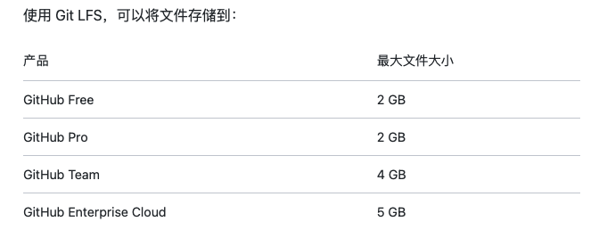

# Git Big File

大文件限制，一般少见，GitHub 对于仓库要上传大文件，做了一些限制。

50M 会受到警告，100M 会被限制。



## 1 安装 Git Large File Storage

```sh
➜  brew install git-lfs
```

然后去到仓库目录下

```sh
➜  git lfs install
Updated git hooks.
Git LFS initialized.
```

## 2. 配置

如果仓库中存在要用于 GitHub 的现有文件，则需要先从仓库中删除它们，然后在本地将其添加到 Git LFS。

关联(跟踪)大文件

```sh
➜  git lfs track "*.psd"
Adding path *.psd
```

之后添加到 `stage`，然后 `commit`，就可以 `push` 到 GitHub了。

## 3. 常见问题

### 3.1 如果大文件被 commit 了，在 push 的时候，被 GitHub 限制了

那么可以把大文件删除，重新提交到 GitHub，具体操作

```sh
➜  git rm --cached <giant_file>
➜  git commit --amend -CHEAD
➜  git push
```
