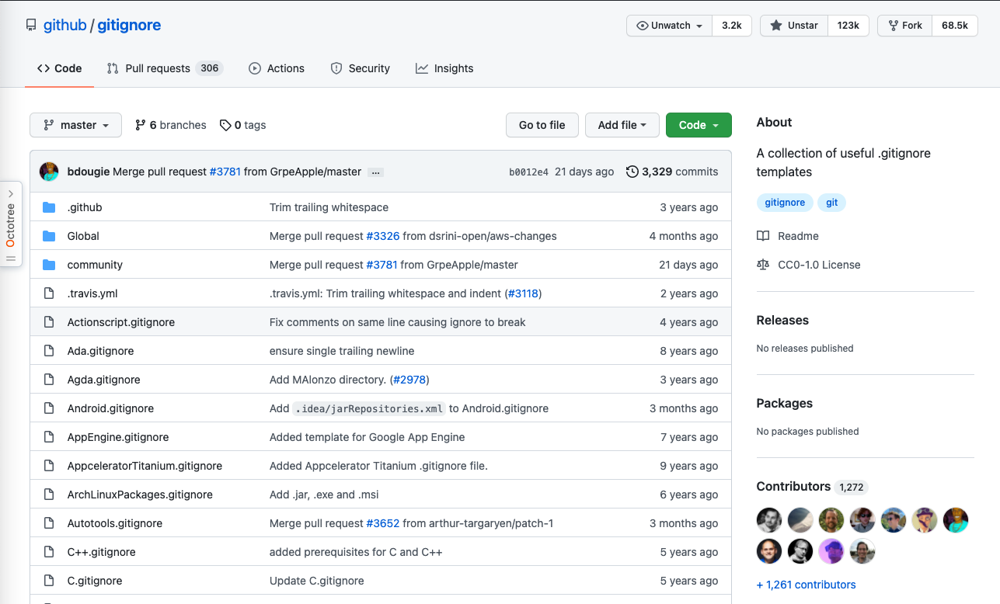

# Git Ignore

## 1. 忽略文件[^git-ignore]

文件 .gitignore 的格式规范如下：

* 所有空行或者以 # 开头的行都会被 Git 忽略。

* 可以使用标准的 glob 模式匹配，它会递归地应用在整个工作区中。

* 匹配模式可以以（/）开头防止递归。

* 匹配模式可以以（/）结尾指定目录。

* 要忽略指定模式以外的文件或目录，可以在模式前加上叹号（!）取反。

所谓的 glob 模式是指 shell 所使用的简化了的正则表达式。

* 星号（*）匹配零个或多个任意字符；

* [abc] 匹配任何一个列在方括号中的字符 （这个例子要么匹配一个 a，要么匹配一个 b，要么匹配一个 c）；
* 问号（?）只匹配一个任意字符；

* 如果在方括号中使用短划线分隔两个字符， 表示所有在这两个字符范围内的都可以匹配（比如 [0-9] 表示匹配所有 0 到 9 的数字）。

* 使用两个星号（\*\*）表示匹配任意中间目录，比如 a/\*\*/z 可以匹配 a/z 、 a/b/z 或 a/b/c/z 等。

一个 .gitignore 文件的例子：

```gitignore
# 忽略所有的 .a 文件
*.a

# 但跟踪所有的 lib.a，即便你在前面忽略了 .a 文件
!lib.a

# 只忽略当前目录下的 TODO 文件，而不忽略 subdir/TODO
/TODO

# 忽略任何目录下名为 build 的文件夹
build/

# 忽略 doc/notes.txt，但不忽略 doc/server/arch.txt
doc/*.txt

# 忽略 doc/ 目录及其所有子目录下的 .pdf 文件
doc/**/*.pdf
```

* [git ignore 规则](https://www.cnblogs.com/kevingrace/p/5690241.html)

## 2. [GitHub Ignore](https://github.com/github/gitignore)

GitHub 上的一个十分详细的针对数十种项目及语言的 .gitignore 文件列表。



## 3. VSCode

VSCode 上也有一个 `gitignore` 插件，方便生成项目的 gitignore 文件。


[^git-ignore]: [git-ignore](https://git-scm.com/book/zh/v2/Git-基础-记录每次更新到仓库)
